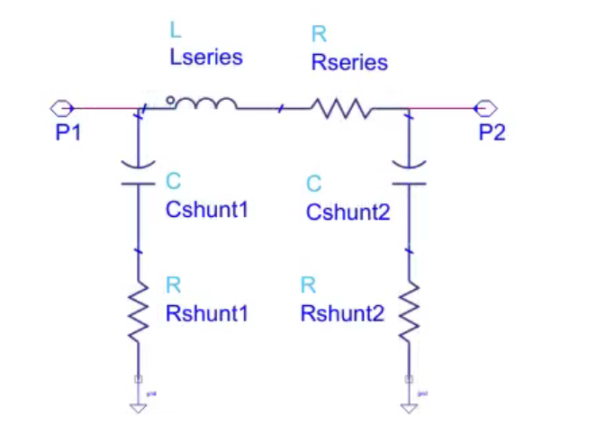
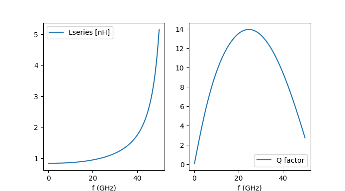
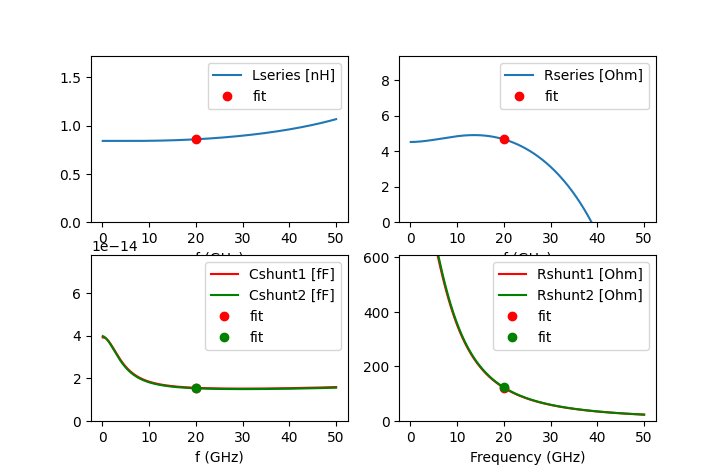
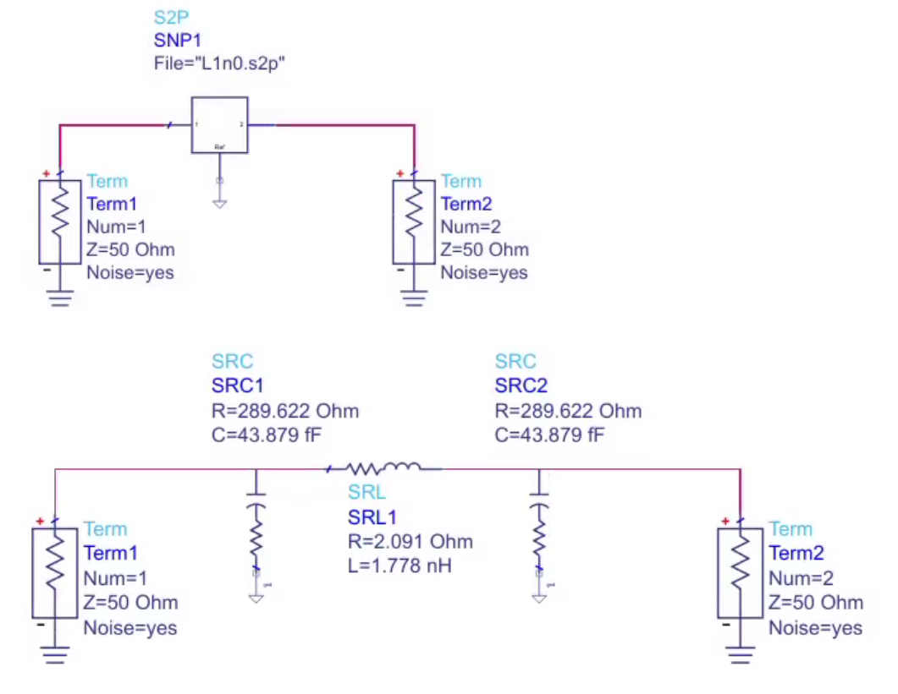
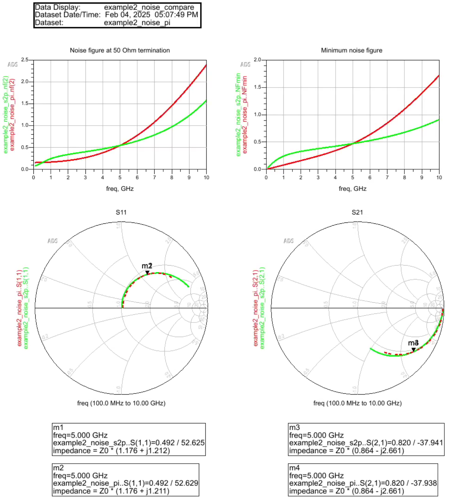
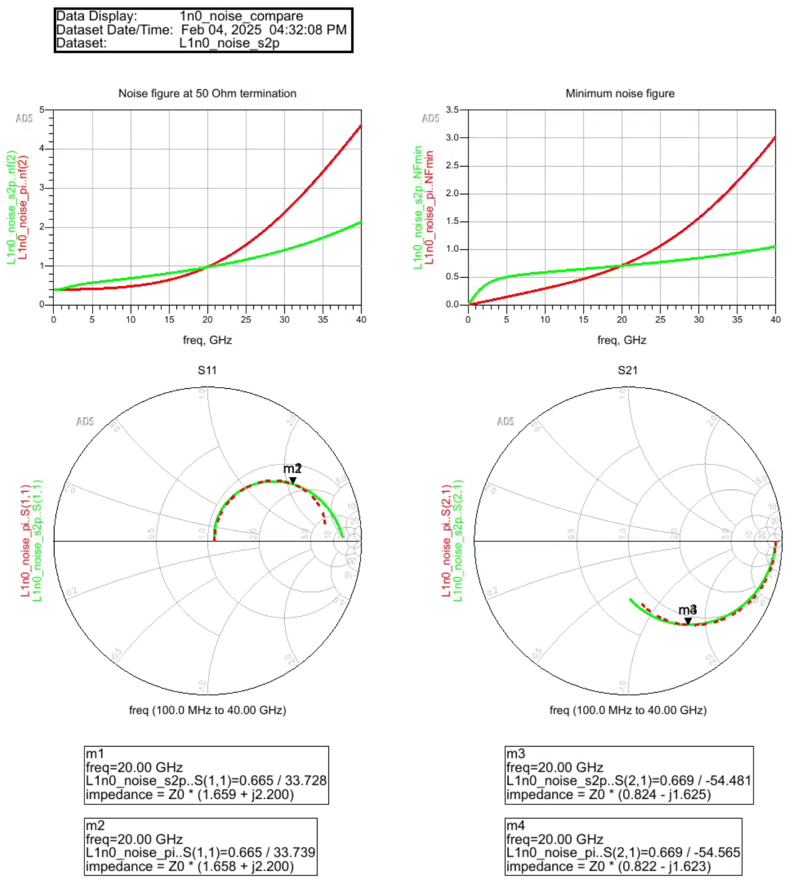

# pi_from_s2p

pi_from_s2p reads S-parameter data (*.s2p) for an RFIC inductor 
and calculates component values for simple narrowband pi model. 



# Theory of operation:
The S-parameters at one user defined frequency are extracted 
and the corresponding series and shunt path elements are calculated.
For the series path, a series combination of L and R is assumed.
For the shunt path at each port, an series combination of C and R is assumed.

This topology matches the requirements of RFIC inductor modelling and 
ensures DC isolation from the coil to the substrate node, even if the 
underlying S2P data is not perfectly accurate at DC.

The model is exact at the extraction frequency, but not wideband.
A wideband physical model for RFIC inductors would require additional
elements, e.g. capacitor across the coil to model self resonance,
additional RL element to model skin effect and shunt path elements
with Coxide in series to Csubstrate || Rsubstrate. 
Such wideband model extraction is not implemented here!

# Prerequisites
The code requires Python3 with the skitkit-rf library.
https://scikit-rf.readthedocs.io/en/latest/tutorials/index.html

# Usage
Ro run the pi model extraction, specify the *.s2p file as the first parameter, 
followed by the extraction frequency in GHz.

example:
```
python pi_from_s2p.py L1n0.s2p 20
```
output: 
```
Extract simple inductor pi model from S2P S-parameter file
S2P frequency range is  0.1  to  50.0  GHz
Extraction frequency:  20.0  GHz

Differential inductor parameters
Effective series L  [nH] : 0.948 @ 20.000 GHz
Effective series R  [Ohm]: 8.822 @ 20.000 GHz
Differential Q factor    : 13.51 @ 20.000 GHz
----------------------
L_DC      [nH] : 0.840
R_DC      [Ohm]: 4.510
Peak Q         : 13.93 @ 24.600 GHz


Pi model extraction (narrowband) at 20.000 GHz
Series L  [nH] : 0.858
Series R  [Ohm]: 4.662
Shunt C @ port 1 [fF] : 15.527
Shunt R @ port 1 [Ohm]: 121.590
Shunt C @ port 2 [fF] : 15.284
Shunt R @ port 2 [Ohm]: 123.214
```
In addition to the values printed at the command line, you also get a 
plot of L and Q in differential mode operation, and a plot of the 
extracted series and shunt path values with a visual marker at the 
extraction frequency.





# Accuracy

Note that the extracted fixed values do not give accurate wide band 
reponse of the S2P data, they are exact only at the extraction frequency.
The underlying model does not exactly replicate the physics on an RFIC 
inductor, and you will notice that frequency dependence of values like 
series resistance looks unexpected: the plots show series R decreasing
with frequency. This is not intuitive, but correct in the context of 
this model: the overall model gives the exact impedances at the 
extraction frequency!

Two examples will be shown below, with S-parameters and noise data
compared between S2P data and extracted pi model.


# Noise simulation

It is reported that Qucs-s can't do noise simulation with S2P files, 
so one use case of this simple pi model extraction is to enable noise 
simulation by replacing the S2P data block with an equivalent circuit model.

To verify the noise of the pi model against the S2P data, two test cases
have been evaluated: a 2nH inductor extracted at 5 GHz and a 1nH inductor 
extracted at 20 GHz. For this test, Keysight ADS circuit simulation was used, 
which supports noise simulation with S-parameter files.

example2, 1nH extracted at 5 GHz:



The comparison of S2P and pi model is show below. Values agree exactly 
for noise figure at 50 Ohm load, minimum noise figure and S11, S21 at 
the 5 GHz extraction frequency.



L1n0, 1nH extracted at 20 GHz:



Again, values agree for noise figure at 50 Ohm load, minimum noise 
figure and S11, S21 at the 20 GHz extraction frequency.

# Result from this tool is not wideband model!

A wideband physical model for RFIC inductors would require additional
elements in the equivalent circuit model, to replicate the physical 
device structure. Such a workflow has been demonstrated here:
https://muehlhaus.com/products/equivalent-circuit-model-fit-for-rfic-inductors

This also requires circuit optimization after initializing components
with pre-calculated starting values, and is beyond the scope of this 
simple pi model extraction.


